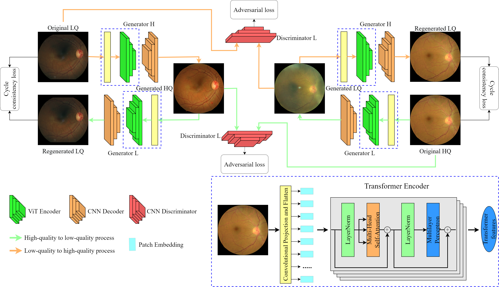

# Official implementation of paper "Retinal Image Restoration using Transformer and Cycle-Consistent Generative Adversarial Network"
## Vision Transformer and Convolutional Neural Network Cycle-Consistent Generative Adversarial



1. Create anaconda environment using the following code: "conda env create -f env.yml".

2. Download EyeQ and/or Mendeley datasets and place them in datasets folder accordingly.

3. Run Train.py selecting the dataset.

4. Run Test.py selecting the dataset.

## <a name="Citing"></a>Citing 

If you use this code, please use the following BibTeX entry.

```
@misc{https://doi.org/10.48550/arxiv.2303.01939,
  doi = {10.48550/ARXIV.2303.01939},
  
  url = {https://arxiv.org/abs/2303.01939},
  
  author = {Alimanov, Alnur and Islam, Md Baharul},
  
  keywords = {Image and Video Processing (eess.IV), Computer Vision and Pattern Recognition (cs.CV), FOS: Electrical engineering, electronic engineering, information engineering, FOS: Electrical engineering, electronic engineering, information engineering, FOS: Computer and information sciences, FOS: Computer and information sciences},
  
  title = {Retinal Image Restoration using Transformer and Cycle-Consistent Generative Adversarial Network},
  
  publisher = {arXiv},
  
  year = {2023},
  
  copyright = {Creative Commons Attribution 4.0 International}
}

```
